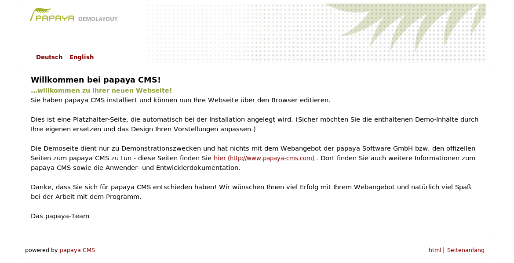

In diesem Kapitel erfahren Sie, wie Sie Print-Templates erstellen können. Diese Templates erzeugen Webseiten, die für den Ausdruck besonders geeignet sind. Dabei werden alle Boxen ausgeblendet. Layoutgrafiken werden ebenso entfernt wie farbige Hintergründe.

Die folgende Abbildung stellt eine beispielhafte Druckansicht vor:

[Kategorie:Templates und Themes entwickeln](export_de/Kategorie:Templates_und_Themes_entwickeln.md)
