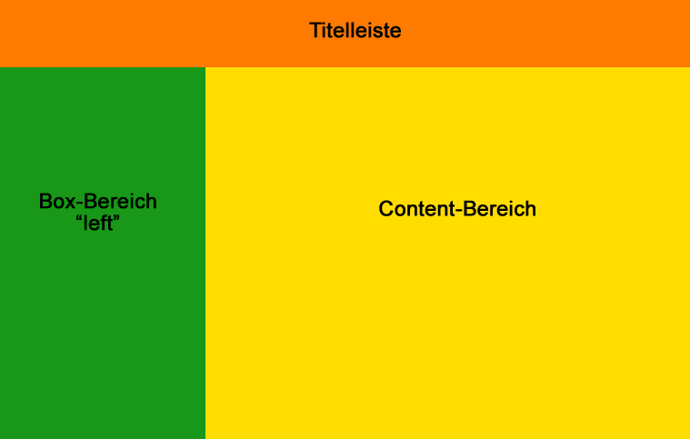

Im Folgenden soll dargestellt werden, wie Sie von einem Layout-Konzept zur konkreten Implementierung einer papaya-Webseitenvorlage gelangen können. Dabei sollten Sie beachten, dass in papaya CMS eine Seite aus drei verschiedenen Elementen zusammengesetzt ist:

-   Statische Elemente: Statische Elemente sind vor allem Objekte wie Layoutgrafiken oder Titel- bzw. Fußleisten mit Inhalten, die auf allen Seiten gleich bleiben.
-   Inhaltselemente: Inhaltselemente werden durch Seitenmodule generiert und im Content-Bereich einer Webseite dargestellt.
-   Funktionselemente: Funktionselemente werden durch Boxmodule generiert und in entsprechenden Boxbereichen dargestellt. Zu den Funktionselementen gehören bspw. die Seitennavigation, die Suche sowie weitere Kontextinformationen.

Wenn Sie ein Webseitenlayout planen, legen Sie also Layout und Grafik fest und bestimmen die Position des Inhaltselements sowie der einzelnen Funktionselemente. Bei der Konzeption von Aufbau und Inhalt der Seiten müssen Sie also festlegen,

-   ob ein zwei- oder dreispaltiges Layout verwendet werden soll,
-   welche Boxen auf der Webseite enthalten sein sollen und schließlich,
-   an welcher Stelle Sie Boxen wie die Seitennavigation und die Seitensuche positionieren wollen.

Das Layout und die in der Webseite enthaltenen Elemente richtet sich schließlich nach den Inhalten, die Sie auf Ihrer Site anbieten möchten. Im Folgenden werden Ihnen nun drei mögliche Layouts vorgestellt.

Zweispaltiges Layout
====================

Das folgende Schema stellt ein zweispaltiges Grundgerüst mit Titelleiste dar:

Die linke Spalte stellt den Bereich für die Navigationsboxen dar, während der zentrale Content-Bereich den Rest der Bildschirmbreite ausfüllt - sofern die Gesamtbreite nicht durch CSS beschränkt wird. Die Titelleiste erstreckt sich wie auch im vorhergenannten Schema über die Gesamtbreite von Box- und Content-Bereich.

Dieses Schema eignet sich vor allem für kleinere Sites, da verhältnismäßig wenig Inhalte auf übersichtliche Weise dargestellt werden können.
