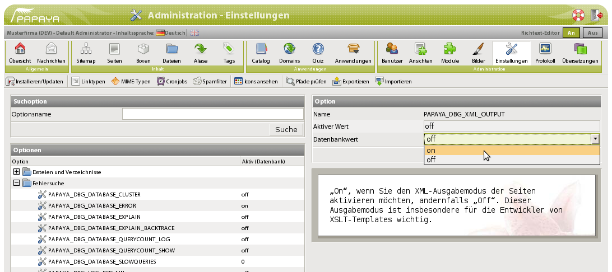

Es ist sehr schwierig, XSLT zu schreiben, ohne das dazugehörige XML zu kennen. Zu diesem Zweck bietet Ihnen papaya CMS die Möglichkeit, die Seite in XML ausgeben zu lassen.

XML-Ausgabe aktivieren

Um diesen Ausgabemodus zu aktivieren, stellen Sie in der Konfiguration die Option PAPAYA_DBG_XML_OUTPUT in der Optionengruppe „Fehlersuche“ auf „on“:

Weitere Informationen zur Konfiguration erhalten Sie im Handbuch für Administratoren und Benutzer in Kapitel .

XML-Ausgabe der Seite erzeugen

Sie können eine Seite auf folgende Weisen in XML ausgeben lassen:

1.  Klicken Sie in der Seitenansicht im Backend auf den Menüpunkt XML Vorschau , während Sie sich in der Seitenvorschau befinden: XML-Vorschau in der Seitenansicht aktivieren
2.  Verändern Sie in der URL-Zeile des Browsers die Dateiendung der HTML-Seite von `.html` auf `.xml`: Endung des HTML-Dokumentes für die XML-Ausgabe verändern.

Im folgenden Abschnitt erfahren Sie Näheres über den Aufbau der XML-Ausgabe.

[Kategorie:Formatvorlagen in papaya CMS](export_de/Kategorie:Formatvorlagen_in_papaya_CMS.md)
