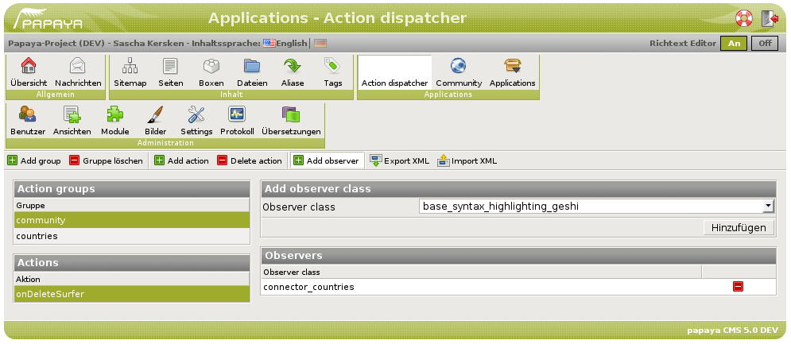

The **Action Dispatcher** is a free papaya module package. It is a papaya-specific implementation of an Observer or Event Handler. An action is a method that can be automatically invoked on each connector module registered in the dispatcher's administration interface. This is practical for cleanup or other tasks that involve more than one specific module and should be automatically triggered by certain events.

How to use it

The action dispatcher defines *groups*, *actions*, and *observers*. An action is identified by a group name (typically a papaya module package) and the action's own name. The observers can be selected from the available connector modules of the current papaya installation including all project-specific extensions. In order to trigger an action, you have to get an instance of the dispatcher's own connector class and invoke its call() method using a group name, an action name, and an optional parameter. The dispatcher will then create instances of all the observers (connector classes) registered for the specific action, and invoke its eponymous method (if available), passing it the parameter (or NULL if not set).

Here's an example: Assuming that a group called 'community' has been defined, and within this group there is an action called 'onDeleteSurfer'. The deleteSurfer() method in the papaya community package's base class contains the following lines (that are only executed if the surfer him- or herself is successfully deleted):

~~~~ {.php}
// Call the action dispatcher method for other modules who need to do surfer cleanup stuff
include_once(PAPAYA_INCLUDE_PATH.'system/base_pluginloader.php');
$actionsObj = base_pluginloader::getPluginInstance('79f18e7c40824a0f975363346716ff62', $this);
$num = $actionsObj->call('community', 'onDeleteSurfer', $surferId);
~~~~

If any observers are registered for the 'onDeleteSurfer' action in the 'community' group, and they feature a method called onDeleteSurfer(), the dispatcher will call these methods in turn, passing them the surfer id. This allows you to do surfer-specific cleanup in any module, both official papaya modules as well as your own extensions. For example, you could delete a surfer's media content or set the author's name in forum discussions to something like 'Anonymous', 'Ex-User', or the like.

Both direct and cyclic recursion within the call process are prevented by examining the backtrace, exiting immediately if the current class and method have already occurred. The event will be reported to the papaya log as an error. If a registered observer class no longer exists, this is reported to the log as well.

Administration

The action dispatcher's administration interface is pretty straightforward (see screenshot).

In the main toolbar, you can add or remove groups, actions, and observers (actions are only available when a group is selected, and observers only when an action is selected). Two additional buttons allow you to export the existing configuration as XML and to import it from XML. This is practical if you have more than one server (e.g. a development and a live server) because you do not need to do manual configuration on each server. For the import, you can choose whether to completely replace the current configuration by the imported data or whether to add it to the existing configuration. An attempt to import a formally valid, but empty configuration file (i.e. <action-observers/> and no more) will not delete your current configuration even in replace mode, an error message will be displayed instead.

The XML format for action dispatcher configuration files looks like this (example):

~~~~ {.xml}
<?xml version="1.0" encoding="UTF-8" standalone="yes" ?>
<action-observers>
  <action-group>
    <name>community</name>
    <action name="onBlockSurfer">
      <observer guid="99db2c2898403880e1ddeeebf7ee726c"/>
    </action>
    <action name="onDeleteSurfer">
    </action>
    <action name="onValidateSurfer">
    </action>
  </action-group>
  <action-group>
    <name>emptyGroup</name>
  </action-group>
</action-observers>
~~~~

Please note that it is **strongly discouraged** to write or edit these files manually. Always use the export function to create them.

Under the toolbar, a list of existing groups is displayed in the left column. As soon as you select a group, its actions (if any) are displayed in a second list underneath the groups list. If you select an action, its registered observers (if any) are displayed in a third list in the main area. The buttons to delete observer registrations are located in the right column of this list.

In *Modules \> Action dispatcher \> Action dispatcher \> Options*, you can set a single module option: whether or not actions are to be automatically registered by the call() method. By default, this feature is turned off (especially because the action dispatcher's database tables do not exist in a new papaya installation). If you turn it on, each invocation of call() will check whether the group/action you are using is already registered, and if not, write them into the database. The event is reported to the papaya log on information level. Please note that auto-registration does NOT actually call any observers because you still have to register these manually or by XML import, but you can learn from the papaya log which new actions are called.

