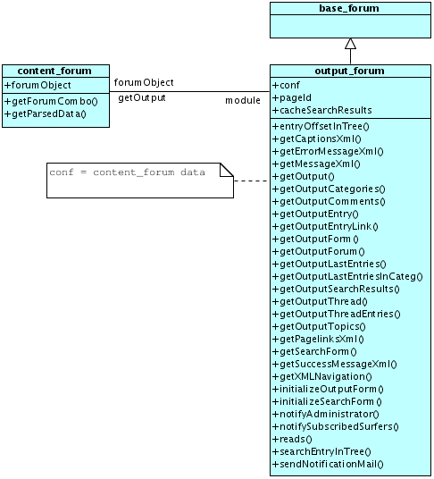
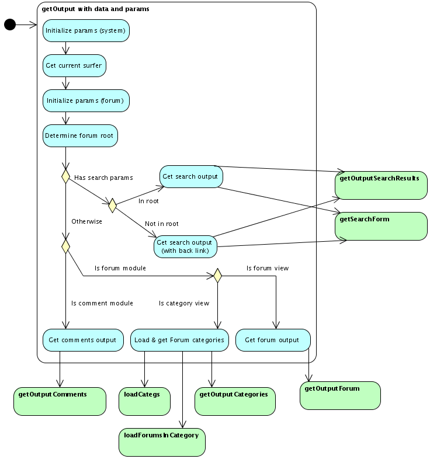

The following UMLs show parts of the current papaya CMS Forum architecture for overview purposes.

Class diagrams

The class diagrams contain the following information:

-   Class names
-   Methods names
-   Method visibilities
-   Generalizations (respectively derivations)
-   Assoziations

Acitvity diagrams

The activity diagrams contain the following information:

-   Initial node
-   Activites
-   Actions
-   Decision nodes
-   Control flows

