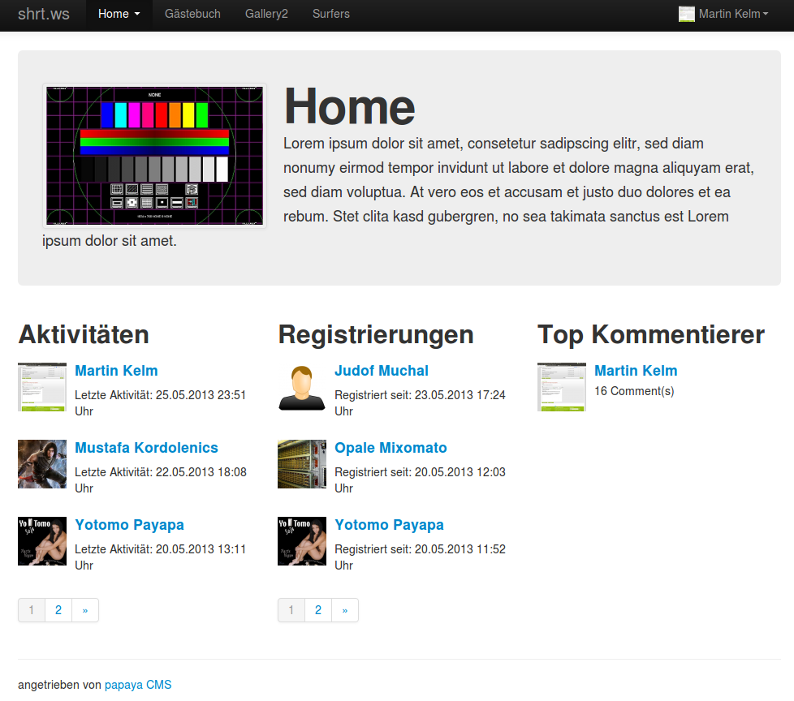

 

The **bootstrap Theme** is an external papaya CMS theme which uses the design templates of the [bootstrap Framework](http://en.wikipedia.org/wiki/Twitter_Bootstrap) to realize papaya CMS pages.

The theme is being developed [here](https://github.com/MKelm/pcms-bootstrap-theme), with the focus to create a community theme with use of [Advanced Community](/Advanced_Community.md). You can [fork](https://help.github.com/articles/fork-a-repo) this repository, if you miss a module support, to implement own extensions. After that you can send a [pull request](https://help.github.com/articles/using-pull-requests) to get the changes into the main repository.

